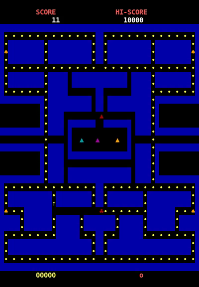

# LPOO_11 - PacMan

O objetivo deste projeto é recriar um jogo PacMan clássico usando o terminal Lanterna em Java.
> Template : https://web.fe.up.pt/~arestivo/page/courses/2020/lpoo/template/
> 
## Implemented Features:
- **Terminal do jogo** - Usando um *Screen* do Lanterna temos uma visão do mapa original do PacMan usando apenas caracteres de terminal.
- **Leitura de mapas** - O jogo consegue ler um mapa formatado a partir de um ficheiro txt e apresentar esse mapa no ecrã.
- **Movimento do Pac-man** - O PacMan está sempre em movimento constante dependendo da sua direção, apenas parando quando vai contra uma parede. É possível alterar a sua posição com as setas do teclado. 
- **Buffer de movimentos** - Antes de chegar a uma curva o *player* pode premir uma tecla para alterar a direção e o PacMan alterará a sua posição assim que conseguir.
- **Colisão com paredes** - O PacMan não consegue passar pelas paredes, só consegue andar em sítios com fundo preto.
- **Colisão com moedas** - Ao tocar numa moeda o PacMan retira essa moeda do mapa e o score é aumentado em 1.



## Planned Features:
- **Power Pellets** - Quando são comidas pelo Pac-man os fantasmas passam para "blue mode", ou seja, passam a poder ser comidos pelo Pac-man
- **Continuidade do mapa** - Caso o Pac-man saia do limite do ecrã, ele reaparecerá no lado oposto
- **Personalidade dos fantasmas** - Cada fantasma terá uma personalidade distinta relativamente à forma como persegue o PacMan.


## Design

### 1. Model-View-Controller
#### Problem in Context
Numa fase inicial do projeto, para ter um jogo funcional (a conseguir abrir uma janela) o código estava dividido por classes mas tudo na mesma package e sem distinção sobre o que cada class fazia (PacMan conseguia guardar a sua informação, desenhar-se a si próprio e atualizar a sua posição). Isto viola seriamente o **Single Responsability Principle** e a forma de resolver foi aplicar o padrão arquitetural **Model-View-Controller**.
#### The Pattern
> MVC consists of three kinds of objects. The Model is the application object, the View is its screen presentation, and the Controller defines the way the user interface reacts to user input.
>
> GoF, Design Patterns - Elements of Reusable Object-Oriented Software

 [1](https://medium.com/totvsdevelopers/protheus-mvc-72901b7efc8a)

Este padrão arquitetural é habitualmente usado para desenvolver programas que contenham uma interface para o utilizador e consiste em dividir uma aplicação em 3 partes:
- O **Modelo** representa os dados do programa.
- A **Vista** mostra os dados do **Modelo** e manda as ações do utilizador para o **Controlador**.
- O **Controlador** fornece dados do **Modelo** à **Vista** e interpreta as ações do utilizador.
#### Implementation
A estrutura do código está dividida de forma a haver 3 packages, cada package referente a um ponto do _MVC_ e uma classe _Application_ que serve como executável e que contém o método _main()_. Cada package de MVC tem dentro as classes referentes ao seu perfil.


| Controller  | Model | View  |
|-------------|-------|-------|
|  |  |  |

#### Consequences
- Divisão do código em packages e melhor organização
- Independência entre módulos possibilita testar cada parte do MVC individualmente

### 2. Factory Method
#### Problem in Context
Será preciso criar ghosts que serão todos semelhantes, excepto a sua forma ao apresentar no ecrã e as suas _personalidades_ (o método que usam para perseguir o PacMan). Em vez de ter uma classe para cada Ghost e definirmos para cada ghost que controlador usará, criaremos uma classe **Creator** para os controladores de cada Ghost.
#### The Pattern
O padrão _Factory Method_ permite que se criem objetos sem especificar explicitamente a classe do objeto que se quer criar. Isto é feito ao chamar o método de fabrico da classe criadora em vez de chamar o construtor da classe do objeto que se pretende criar.
#### Implementation

#### Consequences
Ao aplicar este _design pattern_ torna-se mais fácil definir a personalidade para cada Ghost e a criação de controladores especificos para cada Ghost.
### 3. Strategy 
#### Problem in Context
Seguindo o _design pattern_ acima apresentado, iremos implementar o DP _Strategy_ para que quando seja preciso atualizar o **Model** a partir dos controladores de _Ghosts_ o controlador principal não tenha de se preocupar com qual controlador é que está a lidar.
#### The Pattern
O objetivo deste DP é encapsular algoritmos e fazê-los permutáveis para poder processar um a um. Conseguimos captar a partir da classe abstrata o comum a todas as subclasses e com isto podemos implementar os detalhes apenas nas classes derivadas.

Com este DP também tocamos no **Open-Closed Principle** já que _GhostController_ fica aberto para extensão mas fechado para modificação, apenas aplicável ás subclasses. 
#### Implementation

#### Consequences
- Facilidade para adicionar mais controladores 

## Code Smells
### 1. Bloaters - Large CLass
A meio do Projeto apercebemo-nos que só tinhamos uma classe **Control** que tratava de todo o jogo. Esta tinha demasiados métodos e cada método era demasiado comprido.

**Solution**: Extract Class

A partir de uma só classe foi possível criar **3** classes: CollisionChecker, MapReader e ReadFile. A class MapReader faz uso de ReadFile e a classe original Game faz uso de MapReader para, _you guessed it_, ler o mapa.


### 2. Comments
Os controladores são a parte que vai receber mais trabalho na segunda fase deste projeto, mas por enquanto estão complicados de entender, para isso há métodos que têm demasiados comentários que vão ter de ser removidos antes da entrega final, temos como exemplo o método update do controlador principal:

```java
 private void update(GameData gameData) {
        // Can Pacman move to next position?
            // Pacman's next position?
            // Is a wall in the position pacman is about to move to?
        // yes -> update position
        // no  -> don't update
        if (!checkWallColison(pacManNextPosition())){
            coinColison(gameData.getPacMan().getPosition());
            gameData.update();
        }
    }
```

e o método run, também de Game:
```java
   public void run() throws IOException {
        long startTime = System.currentTimeMillis();
        boolean alreadyin = false;
        // ciclo de jogo
        while(true) {
            // Ler Esc para sair de ciclo
            KeyStroke keyStroke = screen.pollInput();
            if(keyStroke != null ){
                if(keyStroke.getKeyType() == KeyType.Escape || keyStroke.getKeyType() == KeyType.EOF) {break;}
                else{processKey(keyStroke);
                    //pacMan.moveDirection();}
            }
            //Detetar keystrokes de setas e mudar direção de pacman
            // taxa de atualização a cada meio segundo
            if ((System.currentTimeMillis() - startTime) % 250 == 0){
                // como entra mais do que uma vez a cada milissegundo, só vai atualizar uma vez
                if (!alreadyin){
                    System.out.println(System.currentTimeMillis() - startTime);
                    pacMan.moveDirection();
                    draw();
                    alreadyin = true;}
            }
            else{
                // assim que sair do milissegundo em que dá refresh, avisa que pode dar refresh outra vez
                alreadyin = false;
            }
        }
        if (screen != null)
            screen.close();
    }
```
### 3. Code Smell 3

## Self-Evaluation
- André Gomes: x %
- Catarina Fernades: y %