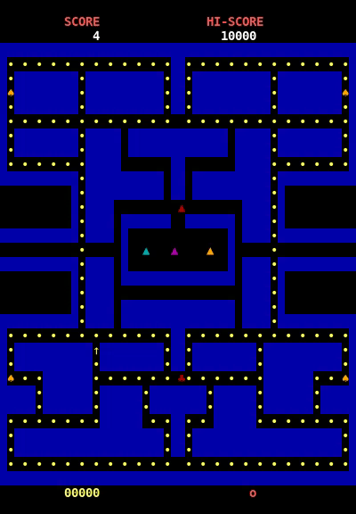

# Documentação 
## (features, design patterns, code smells, refactorings, testes, ...)

## Features:
- Terminal do jogo [DONE]
- Leitura do mapa do ficheiro "mapv2.txt" [DONE]
- Movimento do Pac-man [DONE]
- Buffer de movimentos do Pac-man
- Colisão com paredes [IN PROGRESS]
- Colisão com moedas: elas desaparecem e aumentarem a pontuação
- Power pellets: quando são comidas pelo Pac-man os fantasmas passam ao "blue mode", ou seja, passam a poder ser comidos pelo Pac-man
- Continuidade do mapa: caso o Pac-man saia do limite do ecrã, ele reaparecia do lado oposto
- Personalidade dos fantasmas: um fastasma que persiga o Pac-man
- Buffer de movimentos do Pac-man

 ## Screencast

